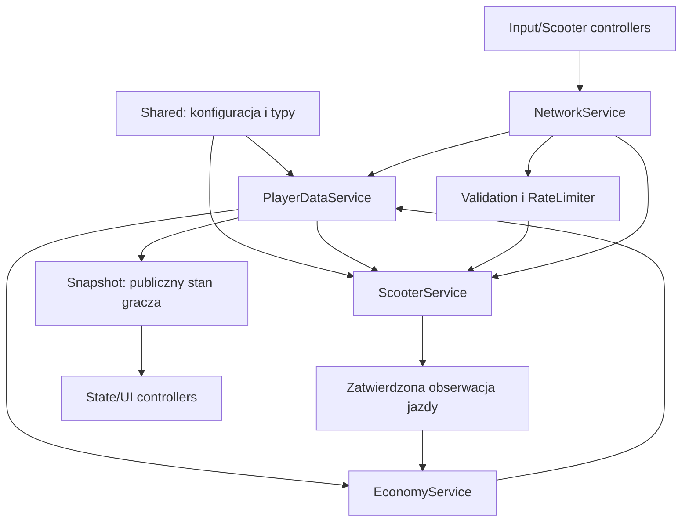

# Architektura — PHASE 0 i fundament PHASE 1

Gra jest miejskim multiplayerem o hulajnogach, rozwijanym etapami. PHASE 0 opisuje całość systemów. Wersja 0.3.0 implementuje fundament PHASE 1 oraz wycinki PHASE 2/3: oryginalny blockout miasta, metadane dróg, NPC traffic, dzień/noc, sklepy, ulepszenia i jedną dostawę. Wszystkie te źródła przechodzą kompilację, analizę typów i dostępne testy logiczne. Odbiór w Roblox Studio nadal jest wymagany; pozostałe systemy są opisem architektury przyszłych aktualizacji.

## Podział odpowiedzialności

- **Serwer** posiada zapis, saldo, doświadczenie, poziomy, kolekcje i obliczenia ruchu hulajnogi. Sam stwierdza spełnienie warunków nagrody.
- **Klient** zbiera zamiar sterowania, wyświetla stan otrzymany od serwera i tworzy interfejs. Nie przesyła salda, statystyk, pozycji pojazdu ani żądanej nagrody.
- **Shared** zawiera katalogi, typy i funkcje bez efektów ubocznych. Jego kod i konfiguracja są widoczne dla graczy. Nie ma tam sekretów, dostępu do DataStore ani uprawnień administratora.
- **Rojo** odwzorowuje źródła na drzewo Roblox. Miejsce w Studio jest środowiskiem uruchomieniowym, a pliki w repozytorium są źródłem kodu.

## Struktura w Studio

```text
ReplicatedStorage
├── Shared
│   ├── Config
│   ├── Types
│   └── Modules
└── Remotes
    ├── Action
    ├── Input
    ├── Snapshot
    └── Feedback

ServerScriptService
└── Server                         Script: src/server/init.server.luau
    ├── Services                   Folder z ModuleScripts
    └── Modules                    Folder z ModuleScripts

StarterPlayer
└── StarterPlayerScripts
    └── Client                     LocalScript: src/client/init.client.luau
        ├── Controllers            Folder z ModuleScripts
        └── Modules                GuiFactory

StarterGui                         Docelowe modele interfejsu, opcjonalnie
Workspace
├── Baseplate                      Plac testowy z konfiguracji Rojo
├── SpawnLocation
├── Map
│   ├── Generated                  Runtime blockout, Roads, Districts, Traffic
│   └── pozostałe foldery          Miejsca na ręczne modele
└── Vehicles                       Aktywne hulajnogi tworzone podczas Play

PlayerGui                          Powstaje dla każdego gracza podczas Play
├── KukirinHUD                     HUD, garaż, sterowanie dotykowe
├── KukirinMenus                   Sklep, zadania, ustawienia
└── KukirinMinimap                 Schemat dróg, własna pozycja, cel dostawy
```

`Server` i `Client` są skryptami zawierającymi foldery z modułami. Nie należy przenosić `Services` obok `Server` ani `Controllers` obok `Client`: odwołania w kodzie korzystają z tego mapowania. Rojo tworzy ModuleScript ze zwykłego pliku `.luau`; sufiksy `.server.luau` i `.client.luau` tworzą odpowiednio Script i LocalScript.

Rojo tworzy `Map/Districts`, `Roads`, `Shops`, `Garages`, `RaceTracks`, `PoliceStations`, `Events` i `NPCs` jako miejsca na własne modele. Obecny generator używa osobnego `Map/Generated`, z atrybutem GeneratedBy. Podczas startu nie usuwa obcego folderu o tej nazwie: zgłasza konflikt. Collectibles i TrafficRoutes mogą powstać wraz z implementacją tych mechanik. Blockout ma 13 dzielnic i 10 dróg; nie zawiera odblokowań, mostów, tuneli ani kompletnej docelowej mapy.

## Moduły i zależności

| System | Odpowiedzialność | Zależności | Etap |
| --- | --- | --- | --- |
| PlayerDataService | Ładowanie, migracja, walidacja schematu, blokada sesji, zapis i zamknięcie profilu | DataStoreService, konfiguracja danych | 1 |
| EconomyService | Sprawdzone operacje Money/XP, awanse, ograniczone nagrody jazdy | PlayerDataService, LevelConfig, RewardConfig | 1 |
| ScooterService | Własność, wybór, spawn/despawn, serwerowa fizyka i pomiary ruchu | PlayerDataService, ScooterConfig, ScooterStats, ScooterFactory | 1 — kod obecny |
| Zabezpieczenia | ParseAction/ParseInput, RateLimiter w NetworkService; ownership i korekta ruchu w ScooterService | Validation, RateLimiter, GameConfig | 1 — kod obecny; osobny agregator logów w przyszłości |
| NetworkService / SnapshotService | Routing i walidacja żądań / publiczna projekcja własnego stanu | Usługi serwera, kontrakty sieci | 1 — kod obecny |
| WorldService/RoadService/DayCycleService | Dzielnice, metadane dróg i limit dla pozycji pojazdu | WorldConfig, RoadConfig | 2 |
| TrafficService | Ograniczona pula NPC, trasy, światła, skrzyżowania | WorldService, WorldConfig | 2 |
| QuestService | Aktywne cele, cooldowny, ukończenia liczone przez serwer | Dane, EconomyService, obserwacje jazdy | 3 |
| RaceService | Lobby, odliczanie, checkpointy, czas i końcowe wyniki | Dane, WorldService, ScooterService, EconomyService | 3 |
| ShopService / ScooterStats | Zakup hulajnogi, upgrade, wymagany poziom i cena / czyste przeliczanie statystyk | Dane, EconomyService, ScooterService, WorldService, UpgradeConfig | 3 — podstawowy kod obecny |
| TrickService | Weryfikacja skoku/obrotu, combo i limity nagród | ScooterService, EconomyService | 3 |
| EventService | Typ, uczestnicy, start/koniec, cooldown, dokładnie raz naliczane nagrody | EconomyService, usługi danej aktywności | 3/5 |
| CollectibleService | Jednorazowe znajdźki w określonej odległości | Dane, WorldService, EconomyService | 3 |
| PetService/ClothingService | Kolekcje, zakupy, equip, legalne katalogi assetów | Dane, EconomyService, katalogi | 4 |
| CrewService/PartyService | Zaproszenia, rangi, członkowie i grupy aktywności | Dane, filtr tekstu Roblox, opcjonalnie MessagingService | 4 |
| AchievementService/ChallengeService | Cele oparte na serwerowych licznikach i okresach UTC | Dane, EconomyService, zdarzenia usług | 4 |
| LeaderboardService | Wyniki pochodzące z zatwierdzonych zapisów serwera | Dane, OrderedDataStore, ograniczona kolejka zapisów | 4 |
| GarageService | Własna kolekcja, miejsce prezentacji, dekoracje i trofea | Dane, ScooterService, ShopService | 4 |
| PoliceService | Rola, uprawnienia, pomiary radaru, mandaty i rangi | Dane, RoadService, ScooterService, WantedService | 5 |
| WantedService | Stan poszukiwany, zegar, legalne zakończenie pościgu | PoliceService poprzez kontrakt zdarzeń, dane jazdy | 5 |
| MonetizationService | Game Passes i bezpieczny ProcessReceipt | MarketplaceService, dane, katalog produktów | 6 |
| SeasonService | Wersja sezonu, XP, darmowa/premium ścieżka i odebrane nagrody | Dane, MonetizationService, EconomyService | 6 |
| AdminService | Narzędzia testowe dostępne tylko jawnie wskazanym UserId | Serwerowy katalog uprawnień, usługi | 7 |
| AudioController/WeatherController | Efekty na kliencie na podstawie stanu świata | Ustawienia gracza, konfiguracja legalnych assetów | 7 |

Nazwy przyszłych usług wyznaczają podział odpowiedzialności, ale ich plików nie trzeba tworzyć przed implementacją. Usługi nie wymagają się wzajemnie w cyklu. Skrypt startowy buduje kontekst usług, najpierw inicjalizuje zależności, a dopiero potem uruchamia nasłuchiwanie i pętle.



Strzałka oznacza korzystanie z danych lub przekazanie zdarzenia, a nie zawsze `require` między modułami. Przyszłe systemy reagują na serwerowe zdarzenia domenowe, np. `RaceFinished`, `DistanceValidated`, `TicketConfirmed`; klient nigdy nie wytwarza takich zdarzeń jako dowodu wykonania.

## Kontrakty sieciowe

W PHASE 1 są cztery RemoteEvents. Ich nazwy są stałe; nie tworzymy nowego RemoteEvent dla każdego sklepu, questa lub hulajnogi.

| RemoteEvent | Kierunek | Dane i zaufanie |
| --- | --- | --- |
| Action | Klient → serwer | Nazwa dozwolonej akcji i mały payload, np. synchronizacja lub spawn. Serwer odrzuca nieznane akcje, niepoprawne typy i nieposiadane modele. |
| Input | Klient → serwer | Zamiar gazu, skrętu, hamowania i skoku. Nigdy `CFrame`, prędkość docelowa, Money lub XP. |
| Snapshot | Serwer → klient | Projekcja własnego profilu i aktualny stan pojazdu. Klient ma kopię do wyświetlania. |
| Feedback | Serwer → klient | Wynik operacji i czytelny komunikat; nie przyznaje nagród na kliencie. |

Wejście jazdy jest wysyłane około 10 razy na sekundę, a pełny HUD odświeżany projekcją około 5 razy na sekundę. Każdy gracz ma osobne limity akcji i sterowania. `NaN`, nieskończoność, zbyt duże lub obce struktury danych są odrzucane. Ruch jest obliczany z dozwolonych statystyk serwera; serwer pozostaje właścicielem sieciowym fizyki pojazdu.

Zaakceptowanie żądania nie oznacza prawa do nagrody. Nagrodę tworzy EconomyService dopiero po zatwierdzonej obserwacji jazdy lub późniejszym zdarzeniu systemu. Akcja zakupu zawiera identyfikator katalogowy, a nie cenę, ilość XP lub nowe statystyki.

## Dane gracza

Typy Luau rozdzielają trwały profil, stan sesji oraz publiczny snapshot. W profilu znajdują się dane wymagane już teraz oraz znormalizowane kolekcje przygotowane na późniejsze etapy.

| Grupa | Pola docelowego profilu |
| --- | --- |
| Wersja i progres | SchemaVersion, Money, Level, XP, Reputation, DriverScore |
| Hulajnogi | OwnedScooters, SelectedScooter, ScooterUpgrades, ScooterCustomization |
| Kolekcje | Pets, EquippedPet, Clothing, Inventory, Achievements |
| Społeczność | CrewId |
| Policja | PoliceLevel, PoliceXP, PoliceReputation, PoliceCredits, PoliceRank |
| Pomiar i limity | Statistics, okresowe liczniki zatwierdzonych nagród |
| Preferencje | Settings: skala UI, grafika, dźwięki, ograniczone efekty |
| Przyszłe sezony | Wersja sezonu, SeasonXP, odebrane poziomy, Daily/Weekly, tutorial |

`XPToNextLevel` jest wyliczane z LevelConfig, a nie zaufane z klienta. Nie zapisujemy całego modelu fizycznego, aktywnego pościgu, połączeń eventów, części Workspace ani pozycji zgłoszonej przez klienta. Stan sesji zawiera aktywny model hulajnogi, ostatnie wejście, pomiary odległości, cooldowny i token blokady.

Money i XP są nieujemnymi liczbami całkowitymi z serwerowymi limitami. Serwer sprawdza i uzupełnia profil podczas ładowania. Migracje `vN → vN+1` muszą być jawne, idempotentne i przetestowane na kopii zapisów. Nie zmieniamy nazwy produkcyjnego DataStore, aby obejść błąd wczytania.

### Zapis i ochrona sesji

- Domyślne testy Studio używają pamięci sesji. Reset przy kolejnym Play jest zamierzony i nie wymaga włączenia API Services.
- Gra opublikowana używa DataStore `KukirinCity_PlayerData_v1` i `UpdateAsync`. Brak możliwości bezpiecznego załadowania danych blokuje wejście do rozgrywki z profilem, zamiast tworzyć pusty zapis zastępczy.
- Dokument gracza posiada blokadę sesji z identyfikatorem i terminem ważności. Operacja ładowania atomowo przejmuje tylko wolną/wygasłą blokadę. Aktywna blokada innego serwera nie jest nadpisywana.
- Lease wynosi 180 sekund, autosave około 60 sekund. Save sprawdza posiadanie blokady i odnawia ją. Po wykryciu utraty blokady profil przestaje przyjmować mutacje.
- Zapis następuje cyklicznie, przy `PlayerRemoving` i przy `BindToClose`, z ograniczonymi próbami i opóźnieniem po błędzie. Nie zakładamy, że Roblox zagwarantuje zapis przy każdym awaryjnym zamknięciu.
- Studio może korzystać z DataStore dopiero po świadomym włączeniu w serwerowej konfiguracji. Do takich testów używamy **osobnej nazwy magazynu**, bez dostępu do danych produkcyjnych.

Nie wolno używać wartości z klienta do zastąpienia profilu ani drukować całych danych gracza w logach. Logujemy kategorię błędu, UserId i potrzebne identyfikatory operacji, bez sekretów i niepotrzebnych danych osobowych.

## Nagrody i zabezpieczenia PHASE 1

Starter jest bezpłatny i już posiadany; klient może poprosić o jego wystawienie. Jeden gracz ma najwyżej jedną aktywną hulajnogę. Spawn, śmierć, odrodzenie, despawn i wyjście sprzątają model i połączenia.

Obserwowana jazda jest dzielona na odcinki. Przyznanie nagrody wymaga realnego, zweryfikowanego przemieszczenia podczas prawidłowej jazdy, bez teleportu. Przykładowy aktualny balans to 250 metrów na nagrodę 25 Money i 15 XP, ze wspólnymi dziennymi limitami 1000 Money, 2000 XP i 200 Reputation dla obecnych źródeł. Limit Money obejmuje nagrody awansu. W przyszłości należy jawnie rozdzielić budżety aktywności i wydatki, zachowując wspólny górny limit. Awans jest wyliczany wyłącznie przez serwer.

Podejrzany pojedynczy sygnał nie powoduje automatycznego bana. Niedozwolone wejście jest odrzucane, podejrzany dystans nie jest nagradzany, a powtarzające się anomalie mogą zablokować sterowanie lub sesję pojazdu. Rozbudowany system moderacji będzie osobnym etapem; PHASE 1 nie obiecuje pełnej ochrony wszystkich przyszłych mechanik.

## Konfiguracja całości

| Katalog konfiguracji | Co będzie zmieniane bez edycji usług |
| --- | --- |
| ScooterConfig | Id, nazwa, cena, poziom, rzadkość, TopSpeed, Acceleration, Handling, Braking, Jump, Battery, Stability |
| LevelConfig/RewardConfig | Krzywa XP, nagrody, limity aktywności i nagroda awansu |
| GameConfig (dane i bezpieczeństwo teraz; osobne katalogi później) | Wersja schematu, magazyn, okresy zapisu, limity wejścia i tolerancje pomiarów |
| WorldConfig/RoadConfig | Dzielnice, odblokowania, RoadId, SpeedLimit, RoadType, District, PoliceEnabled |
| QuestConfig/RaceConfig | Cele, trasy, kolejność checkpointów, nagrody, wymagania i cooldowny |
| UpgradeConfig/TrickConfig | Poziomy ulepszeń, ceny, wpływ na statystyki, wykrywalne tricki |
| PetConfig/ClothingConfig | Katalog, legalne assety, rzadkości, małe bonusy, ceny |
| PoliceConfig/EventConfig | Progi wykroczeń, cooldowny kar, rangi, wydarzenia i nagrody |
| MonetizationConfig/SeasonConfig | Zweryfikowane ID Roblox, wyłącznie dozwolone korzyści, sezon i jego ścieżki |
| AudioConfig/WeatherConfig | Legalne ID dźwięków, dzień/noc, atmosfera i niewielkie efekty pogody |

Wspólny katalog może być widoczny klientowi do budowania menu. Serwer i tak ponownie odczytuje własną kopię i sprawdza warunki; ukrycie ceny lub nazwy remota nie stanowi zabezpieczenia.

## Wymagania dla przyszłych systemów

1. **Questy i wyścigi:** cele są liczone z serwerowego ruchu i zdarzeń. Checkpointy wymagają kolejności, obecności pojazdu i fizycznie wiarygodnego czasu. Ukończenie ma identyfikator i może rozdać nagrodę raz.
2. **Policja:** radar używa pomiaru serwera i RoadData. Mandat wymaga świeżego dowodu wykroczenia, roli, odległości i cooldownu pary graczy. Nie nadajemy klientowi prawa do teleportowania lub karania. Nagrody za tę samą parę uczestników są ograniczone, aby utrudnić zmowę.
3. **Crew:** nazwy i inne treści graczy przechodzą filtrowanie Roblox; role i zaproszenia mają serwerowe uprawnienia. Wspólne dane crew wymagają osobnego magazynu i kontroli współbieżności.
4. **Monetyzacja:** `ProcessReceipt` sprawdza ProductId i PurchaseId, a nadanie i oznaczenie zakupu musi być trwałe i idempotentne. Nie potwierdzamy `PurchaseGranted` przed bezpiecznym zapisem. Brak ID produktów oznacza brak aktywnego zakupu, a nie fikcyjne ID.
5. **Rankingi:** tylko zatwierdzone wyniki serwera są kolejkowane do OrderedDataStore. Wyścig zakończony przez klienta nie jest źródłem rekordu.
6. **Mobilna wydajność:** mapa ma StreamingEnabled, ograniczone pule NPC, efekty i pętle. Klient nie zakłada, że dalekie części istnieją już w Workspace. Istotne reguły drogi i trasy są obsługiwane przez serwer.

## Granice i etapowanie

Obecna wersja obejmuje już sklepy, dostawę i blockout. Nie ma wyścigów, trick score, policji, monetyzacji ani społeczności. Fundament i nowe wycinki wymagają odbioru opisanego w [TESTING.md](TESTING.md). Nie uznajemy testów logicznych za test w silniku. [ROADMAP.md](ROADMAP.md) wskazuje następne kroki i kryteria gotowości, a [ASSETS.md](ASSETS.md) rozdziela istniejące placeholdery od modeli i dźwięków wymagających późniejszego dodania.

## Obecna dostawa i transakcje

ShopService wykonuje zakup bez yieldów między obciążeniem a nadaniem własności/upgrade. Sprawdza ready profile, lokalizację sklepu, stan pieszy, cenę własnego katalogu, poziom i własność. QuestService przechowuje aktywną dostawę tylko w pamięci sesji: token GUID, baseline zweryfikowanego dystansu i monotoniczny czas. Ukończenie wymaga Riding, minimum czasu i dystansu oraz walidowanej pozycji hulajnogi przy celu. Remote FinishQuest nie istnieje. Po udanym reward zapisuje cooldown UTC i DeliveriesCompleted. Anulowanie/wyjście usuwa stan aktywny; próby cancel/start mają cooldown.

Upgrades zawiera siedem kategorii. Sześć można kupić: Motor, Brakes, Tires, Suspension, Steering, Acceleration. Battery ma Enabled=false: nie pobiera pieniędzy, dopóki nie istnieje realne zużycie i ładowanie. Stability wpływa na tłumienie bocznego poślizgu i utrzymywanie orientacji. Nie ma fizycznie obracających się kół, animacji stojącego jeźdźca ani profesjonalnego zawieszenia — ScooterFactory tworzy spawany model placeholder.

## Kontrolery obecnej wersji

UIController buduje HUD/garaż/dotyk, InputController steruje intencjami i blokuje natywny skok podczas jazdy. MenuController obsługuje zakup, upgrade, zadanie i opcje; otwarte menu hamuje. MinimapController wyświetla stały plan miasta, lokalnego gracza i serwerowy cel; nie odczytuje dalekich części wymagających streamingu. SettingsController lokalnie ukrywa oznaczone WorldDecoration przy niskiej jakości; nie zmienia kolizji ani limitów prędkości. ScooterController jest adapterem Snapshot/Feedback. Nie są to kontrolery wyścigu lub policji.

Kolejność serwera: Init wszystkich, Start World → Roads → Traffic → DayCycle → Network → Snapshot → Scooter → Economy → Shop → Quests → PlayerData. Kolejność klienta: Init wszystkich, Start UI → Input → Menu → Minimap → Settings → Scooter, następnie Sync. Gotowe zależności trafiają do jawnego kontekstu; services nie wymagają wzajemnie swoich ModuleScripts. Wywołania wymagające danych sprawdzają readiness niezależnie od kolejności startu.
