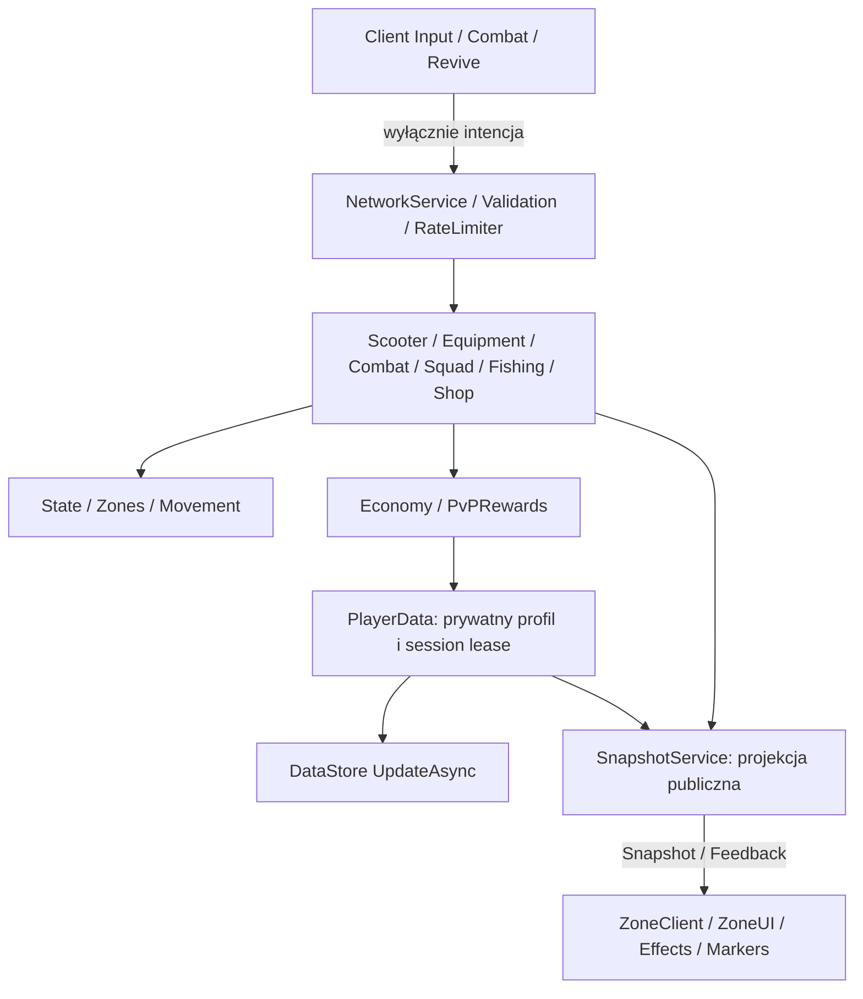

# Architektura 0.5.0

Bootstrap wybiera Foundation, ZoneGame lub LegacyCity. Domyślnie ZoneGame. Każda usługa dostaje `context` przez Init, wszystkie Init kończą się przed Start, a PlayerData startuje na końcu. Brak wzajemnego require usług: dependency injection pozwala uruchamiać te same moduły w deterministycznych testach.

## Usługi

| Usługa | Odpowiedzialność i zależności |
| --- | --- |
| PlayerDataService | Load/sanitize/save/retry, kolejka zapisu, wersjonowanie mutacji, autosave, lease, BindToClose. |
| EconomyService | Spend, dokładne Credit ze źródłem/limitem/receipt, XP/Level i zweryfikowane nagrody jazdy. Jedyny punkt zmiany waluty. |
| ZoneWorldService | Własny runtime blockout, stanowiska/prompty, display models. Movement weryfikuje odległość stanowisk. |
| MovementService | Próbkowanie 5 Hz, teleport/speed/flight/wall checks, korekta i czasowa odmowa aktywności; API zaufanych teleportów serwera. |
| ZoneService | Detekcja tych samych granic co mapa z ZoneConfig, zatwierdzona pozycja. |
| ZoneStateService | Health 100 niezależne od natywnej śmierci, SAFE/ALIVE/COMBAT/DOWNED/REVIVING/RESPAWNING/FISHING, tag, protection, respawn. |
| ScooterService | Maksymalnie jedna hulajnoga na właściciela, serwerowa fizyka 20 Hz, collision, statystyki, bateria, ładowanie, kolekcja. |
| ShopService | Cena/Level/ownership/max-upgrade/radius stanowią warunki zakupu. ScooterStats liczy wynik. |
| EquipmentService | Własność/loadout/ammo/reload/fire cooldown/mobility. Zmiana slotu nie uzupełnia ammo. |
| SquadService + SquadStore | Leader, 4 sloty, zaproszenia 30 s, accept/decline/kick/leave/transfer/cleanup. |
| CombatService | Pozycja początkowa z głowy na serwerze, raycast z celowaniem klienta jako intencją, walls/range/FF/protection/tag, contribution ledger i unikalny encounter. |
| ReviveService | Jedna rezerwacja celu, hold keepalive, 5 s/range/LOS/squad, przerwanie, 35 HP/protection2, anulowanie encounter. |
| PvPRewardService | Jednorazowe settlement, kills/deaths/assists/revives, streak/bounty, utrwalone okna przeciwników i revive. |
| FishingService + FishingRules | Automat 18–28 s, inventory60, timeout15 min, katalog cen, revision, dokładna sprzedaż i wspólny zapis inventory/Money. |
| CosmeticService + AvatarPresentationService | Zakupy z whitelist, wyłącznie wygląd, placeholdery tagów/kamizelki/energy core/hulajnogi. |
| ObjectiveService | 2 obecnych teammate, hold30 s, contested, cooldown180 s, serwerowe nagrody. |
| LeaderboardService | Cache aktualnego serwera co5 s, publiczne K/D/A/R/streak/Level. Nie przyjmuje wyników klienta. |
| DayCycleService | Lighting, doba20 min, lampy. |
| NetworkService + SnapshotService | 4 RemoteEvents, monotonic RequestId, limity i strict payload schema; prywatny profil nie opuszcza serwera. |

## Kontrakty

`ReplicatedStorage.Remotes.Action` przyjmuje `{Action, Payload, RequestId}`. Payload ma ścisłą whitelist pól i typów. Action odrzuca nieznane/duże/zagnieżdżone dane i niepoprawne liczby. Globalny token bucket oraz cooldown konkretnej akcji działają niezależnie od klienta. Shoot niesie tylko jednostkowy kierunek X/Y/Z i Aim; serwer wybiera origin, damage, ammo, range i target. Nie ma endpointów Reward, SetMoney, SetHealth ani FinishRace.

`Input` przyjmuje wyłącznie Throttle/Steer/Brake/Jump, z osobnym limiterem i timeout. `Snapshot` wysyła projekcję własnego inventory/ustawień oraz publiczne dane teammate i ranking; nigdy session lease, receipts, dzienne budżety lub historię anti-farm. `Feedback` niesie wiadomości, otwarcie menu i zatwierdzone efekty. Idempotencja zakupu wynika z własności/poziomu i ograniczeń requestów; nagrody mają receipt i encounter settlement guard.

## Profil i zapis

ProfileSchema zachowuje schema1 i istniejące ID. Dodaje statystyki, OwnedEquipment/EquippedLoadout, fish inventory, cosmetics/customization, baterie, ActivityBudget UTC, PvPOpponents i ReviveHistory. Sanitizer ogranicza rozmiary/liczby i uzupełnia defaulty; nie przyjmuje profilu klienta. CurrentStreak resetuje się przy nowej sesji, BestStreak jest trwały. Health/Downed/CombatTag/Ammo/Squad są stanem sesji; nie są kontynuowane po load.

PlayerData używa UpdateAsync do zajęcia/odnowienia lease i zapisu całego profilu. Dirty version zabezpiecza zmiany powstałe w trakcie yielding save. Failing load nie nadpisuje profilu defaultami. Sales: serwer oblicza wartość, Credit może odmówić całości, a dopiero po sukcesie wymienia listę ryb. Obie zmiany dotyczą jednego profilu bez yield między nimi. Snapshot pośredni może chwilowo pokazać nowy Money przed następnym snapshotem inventory; klient nie decyduje o transakcji. Save jest jedną aktualizacją całego profilu.

Daily source caps: PvP10000, Fishing2000, Objective3000, Revive400. Balans jest konfigurowalny. Stara nagroda jazdy i ogólne XP mają własny budżet RewardConfig. Awaria serwera przed autosave może utracić niezapisane zmiany; lease i retry nie stanowią gwarancji infrastruktury.

## Rozbudowa

Nowa hulajnoga: ScooterConfig + placeholder Factory lub integracja legalnego modelu. Nowe wyposażenie: EquipmentConfig i opcjonalny legalny asset, bez nowego remote. Nowa ryba: FishingConfig; cenę wylicza FishingRules. Nowa strefa: ZoneConfig i ZoneWorldService. Nowa aktywność korzysta z Movement/State, server timer, Economy:Credit/Reward i receipt, nie z wyniku klienta.

Legacy World/Roads/Traffic/Quests i ich UI są zachowane, lecz nieaktywne w ZoneGame. Nie reintrodukuj przez ich ręczne uruchamianie; dodaj świadomą usługę do odpowiedniego bootstrapu. Grafika, audio, animacje i globalny cross-server ranking pozostają osobnymi etapami odbioru/rozbudowy.
