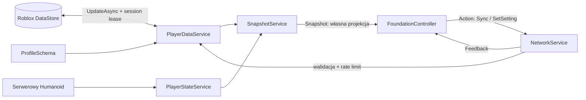

# Architektura KUKIRIN ZONE — PHASE 0

Źródło wymagań: [SPEC_ZONE.md](SPEC_ZONE.md). Aktualne ustawienia: `GameConfig.FoundationOnly = true`, `Phase = 0`. Kod wcześniejszego miasta zachowano, lecz nie jest uruchamiany. Nie przełączaj flagi, aby „włączyć nową grę”: gałąź false to starszy prototyp, nie ukończony KUKIRIN ZONE.

## Podział i zależności

`Server` to Script z bootstrapem i dziećmi Services/Modules; `Client` to LocalScript z Controllers/Modules. Bootstrap tworzy kontekst z Config, Schema, Validation, RateLimiter, Remotes i Services. Wszystkie usługi mają `Init(context)` przed `Start()`. Inicjalizacja następuje w określonej kolejności, bez cyklicznych require między usługami. Moduły Types zwracają pustą tabelę runtime i eksportują typy Luau.

Aktywne usługi serwera:

| Usługa | Odpowiedzialność | Zależności |
| --- | --- | --- |
| PlayerDataService | Prywatny profil, load/save, retry, session lock, dirty, autosave, cleanup | ProfileSchema, GameConfig, Roblox DataStoreService |
| EconomyService | Serwerowe API transakcji i XP oraz leaderstats; heartbeat jazdy wyłączony | PlayerDataService, Progression, RewardConfig |
| PlayerStateService | Odczyt serwerowego Humanoid, HealthReady, ALIVE/RESPAWNING, odłączenie starej postaci | CombatConfig.MaxHealth, Players |
| NetworkService | Format/limity/replay/cooldown, Sync i SetSetting; blokada pozostałych akcji | Validation, RateLimiter, PlayerData, Snapshot |
| SnapshotService | Publiczna kopia własnych danych dla jednego klienta, 5 Hz oraz po zmianie | PlayerData, PlayerState, ProfileSchema |

Klient uruchamia wyłącznie FoundationController: własny HUD, skala i odświeżenie. GuiFactory tworzy kontrolki. Brak autorytetu klienta nad zdrowiem, pieniędzmi czy wynikiem. Ekonomia nie przyznaje automatycznych nagród w tej fazie. `EconomyConfig` i nowe katalogi stanowią kontrakty następnych etapów; kwoty używane przez istniejące API nadal kontrolują GameConfig/RewardConfig.

## Przepływ

1. Nowy gracz: PlayerState obserwuje jego postać; PlayerData ładuje, sprawdza UserId i schemat, nabywa blokadę i udostępnia profil dopiero po powodzeniu.
2. Klient podłącza odbiorniki, następnie wysyła Sync. `Ready=false` oznacza oczekiwanie lub brak dostępu. Nie tworzymy fikcyjnego publicznego profilu podczas ładowania.
3. Wczytany profil → Notify → leaderstats i Snapshot. Snapshot wysyłany dodatkowo 5 razy/s; prosty, ograniczony rozmiarem własnej kolekcji.
4. SetSetting jest sprawdzany i wpisywany przez serwer. MarkDirty → późniejszy save; Notify → widoczna zmiana skali.
5. Zmiana Health → PlayerState → Snapshot. Reset nie zapisuje Health do profilu i nie nalicza PvP Deaths.
6. Wyjście: usuwa obserwatory, stan sieci i limitery; DataService zapisuje profil i zwalnia blokadę.

## Remotes

Dokładnie cztery RemoteEvents w `ReplicatedStorage.Remotes`; brak RemoteFunctions.

| Remote | Kierunek | PHASE 0 | Docelowo |
| --- | --- | --- | --- |
| Action | klient → serwer | `{Action, Payload, RequestId}`; tylko Sync i SetSetting | Zamiary wyposażenia, squadu, zakupów, revive i fishing; nowe schematy wymagane |
| Input | klient → serwer | Walidacja/limiter, potem ignorowanie | Ograniczone sterowanie pojazdem/aim bez deklaracji trafienia |
| Snapshot | serwer → właściciel danych | Ready/status/mode, Money/XP, statystyki, ustawienia, własna kolekcja, PlayerState | Własny loadout/fishing, squad i publiczne znaczniki zgodnie z widocznością |
| Feedback | serwer → klient | Wynik i kod komunikatu + RequestId | Wynik zatwierdzonej intencji i UI |

Validation odrzuca błędny typ, nieznaną akcję/pola, nieprawidłowe wartości, NaN/Infinity. Ustawienia mają zamkniętą listę i zakresy. RateLimiter ma osobne budżety Action/Input, akcje cooldown oraz rosnący RequestId na sesję. Replay nie oznacza trwałej idempotencji transakcji: serwerowe nagrody wymagają osobnego EncounterId. Powtarzalne sygnały nadużycia są logowane; pojedynczy sygnał nie kickuje gracza. Klient nie podaje salda, ceny, Health ani nagrody. Nawet poprawnie sformatowana dawna akcja Spawn/Buy/Upgrade jest odrzucana `PhaseLocked` przed wywołaniem nieaktywnych usług.

## Dane gracza

Aktualny schemat i sanitizacja: `ProfileSchema`, typ `Types.PlayerData`. Zapis to `{SchemaVersion=1, Data=profile, Session={Token, ExpiresAt}}`. Nazwa magazynu pozostaje `KukirinCity_PlayerData_v1`, klucz profilu nadal `Player_<UserId>`. Nie zmieniamy identyfikatorów istniejących hulajnóg, nawet jeśli nazwy wyświetlane są teraz fikcyjne.

| Grupa | Pola trwałe |
| --- | --- |
| Konto/ekonomia | UserId, SchemaVersion, Money, Level, XP, Reputation, DriverScore |
| Hulajnogi | OwnedScooters, SelectedScooter, ScooterUpgrades, ScooterCustomization |
| Wyposażenie | OwnedEquipment, EquippedLoadout.PRIMARY/SECONDARY/UTILITY, Cosmetics |
| Fishing | FishingInventory: lista FishId/Weight/Rarity; bez zapisanej ceny klienta |
| PvP | Kills, Deaths, Assists, Revives, BestStreak, ZoneTime |
| Ustawienia | UIScale, GraphicsQuality, MusicVolume, SFXVolume, ReducedEffects |
| Zgodność wcześniejszego prototypu | Statistics, QuestCooldowns, Inventory, Achievements, Pets, Clothing, CrewId i pola Police |
| Prywatne | RewardBudget, IdempotencyLedger, token sesji w rekordzie — niewysyłane klientowi |

Nowy profil: Money 100, starter w kolekcji, puste wyposażenie/ryby/kosmetyki, liczniki PvP 0. Przy ładowaniu starego profilu brakujące pola są dodawane; nie wykonujemy destrukcyjnego resetu. Sanitizacja zachowuje do 60 poprawnych ryb, ogranicza długość ID, skończone wagi i znane rarity, usuwa dodatkową cenę. To kontrola formatu zapisu; zakup, sale i wyposażenie w przyszłych usługach muszą jeszcze sprawdzić ID w katalogu. Loadout wskazuje tylko posiadany przedmiot. Unknown/future schema albo uszkodzony rdzeń zatrzymuje udostępnienie danych zamiast nadpisywać profil.

Health, bieżący state, combat tag, downed timer, fishing sesja, squad i bieżący streak będą stanem serwera w pamięci, nie zapisem przy każdym ticku. Obecnie PlayerState wspiera jedynie ALIVE/RESPAWNING i UNASSIGNED; nie implementuje stanów walki. Squad jest sesyjny; przyszłe trwałe klany nie należą do tej wersji.

DataStore: UpdateAsync, token właściciela, lease 180 s, autosave 60 s, retry load/save, zapis na PlayerRemoving i BindToClose. W StudioMemory operacje korzystają z pamięci procesu. Profil niedostępny podczas load/save failures/session loss nie może wydawać pieniędzy. Testy mocków nie potwierdzają działania backendu Roblox.

## Centralne konfiguracje

Nowe kontrakty: EconomyConfig, ZoneConfig, CombatConfig, EquipmentConfig, PvPRewardConfig, FishingConfig. Gameplay `Enabled=false` aż do właściwej fazy. Phase0 nie używa tych flag jako automatycznego loadera przyszłych usług.

- ZoneConfig: przyszłe bryły Safe/Combat/Fishing i granice kompaktowej mapy; zero detekcji lub geometrycznego level designu obecnie.
- CombatConfig: 100 Health, tag 20 s, downed 60 s, revive 5 s, squad 4, FriendlyFire=false. To parametry, nie gotowy combat.
- EquipmentConfig: fikcyjne spark/pulse/prism/focus/nova, 5 kategorii, 3 sloty; bez prawdziwych modeli/broni i bez aktywnego Tool.
- PvPRewardConfig: kill 100, assist 35, revive 40; milestones 3/5/10/15/20, bounties i multipliers 1/.5/.25/0. Nagrody nie są przyznawane w PHASE 0.
- FishingConfig: losowanie po stronie serwera w przyszłej usłudze, bez minigry; wagi rarity sumują się do 100, limit 60. Nie ma aktywnego RNG ani sprzedawcy.
- ScooterConfig: klasy STARTER/CITY/SPORT/PRO/DUAL MOTOR, statystyki, ceny i ID do rozbudowy. UpgradeConfig przygotowuje 0–5, w tym Controller; starsze wpisy zachowano dla zapisów. Przed włączeniem wymagany przegląd balansu i test fizyki.

## Docelowe systemy — jeszcze niezaimplementowane

| Faza | Usługi serwera | Klient | Kontrakty/zależności |
| --- | --- | --- | --- |
| 1 | ZoneService, map builder | MainHUD/ZoneController | PlayerState, ZoneConfig, serwerowa lokalizacja |
| 2 | ScooterService dostosowany do nowego świata | Input/ScooterController | PlayerData, serwerowe statystyki/fizyka, cleanup |
| 3 | GarageService, ShopService, UpgradeService | Garage/ShopController | Economy, ScooterData, potwierdzone dystans/ownership |
| 4 | SquadService | SquadController, markers | Serwerowe invite/expiry, maks. 4, atomowy leave/kick |
| 5 | EquipmentService, CombatService | CombatController | Zone, Squad, PlayerState, cooldown, server raycast/LOS/range |
| 6 | DownedService, ReviveService | Downed/ReviveController | Combat, Squad, strefa, 60 s i zweryfikowane ciągłe 5 s |
| 7 | PvPRewardService, EncounterService, LeaderboardService | Streak/Bounty HUD | Serwerowe encounter, Economy, PlayerData, anti-farming |
| 8 | FishingService, FishInventoryService, FishBuyerService | FishingController | Zone, PlayerState, timer/RNG serwera, limity i ekonomia |
| 9 | CosmeticsService, EquipmentShopService | Shop/LoadoutController | Katalog prawidłowych ID, ownership i Economy |
| 10 | Audio/Effects/settings oraz pomiary | Kontrolery kosmetyczne | Wyłącznie istniejące legalne assety, mobile/network testy |

Zależności tworzymy przez kontekst i jawne metody, nie przez wzajemne require. Nie dodajemy atrap usług zwracających sukces bez implementacji. Nowe mechaniki dostają własne testy i schematy sieciowe przed aktywacją.

Docelowe reguły: ZoneService potwierdza wejście/wyjście, ale combat tag nie jest kasowany przekroczeniem granicy; Safe nie daje natychmiastowej ucieczki z trafienia. CombatService sprawdza stan, wyposażenie, ammo/cooldown, range/LOS oraz friendly fire, nie przyjmuje Damage/Hit od klienta jako faktu. Downed/Revive są serwerowymi przejściami; gracz nie deklaruje ukończonych 5 sekund. EncounterService nadaje jednorazowe ID i rejestruje wkład/rozliczenie, nagroda przysługuje raz. Przed PHASE 7 potrzebny jest model trwałego rozliczania i budżetów PvP; obecny ograniczony legacy ledger nie wystarcza sam do gwarancji jednorazowych wypłat po crashu. FishingService sam wybiera gatunek/wagę, a buyer oblicza cenę z Config i atomowo usuwa sprzedawane pozycje przed nagrodą.

Mapy i modele znajdują się w osobnych folderach i powstaną później. Streaming działa już w konfiguracji; nie zastępuje limitów NPC, efektów, snapshotów ani pomiarów na telefonie.
