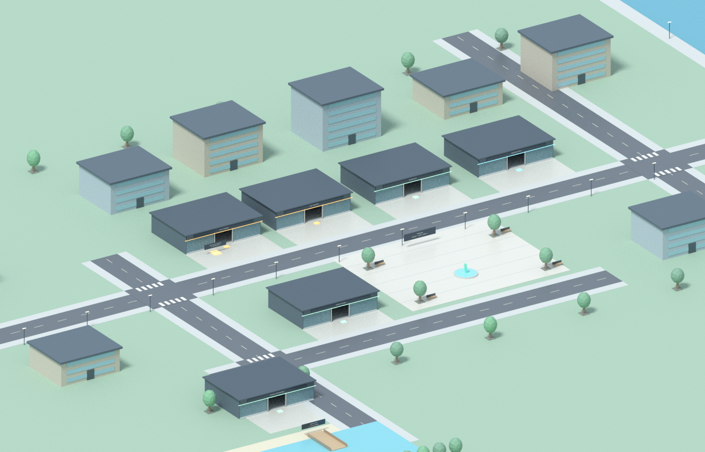
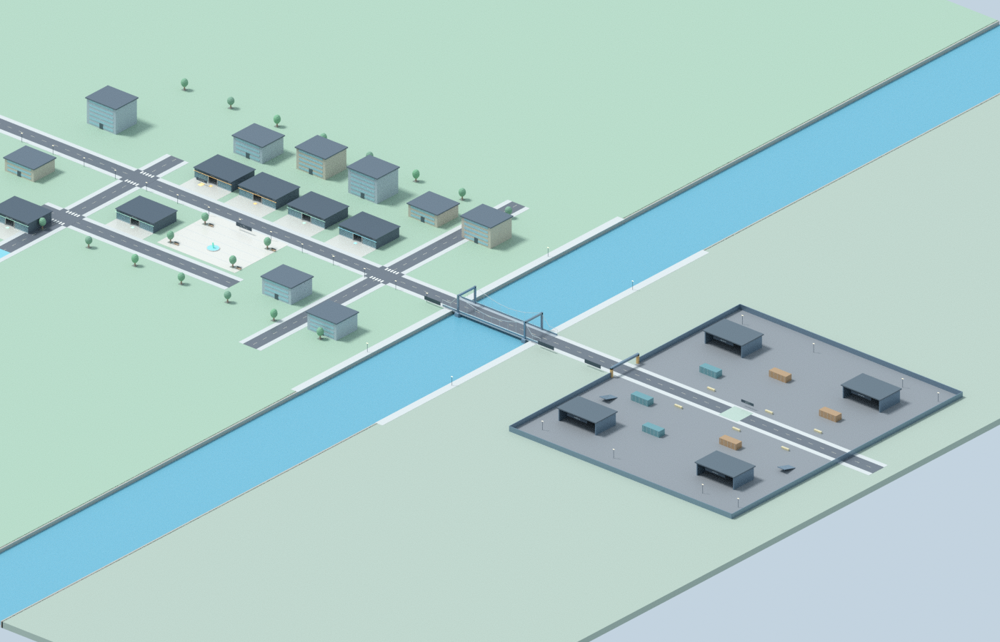
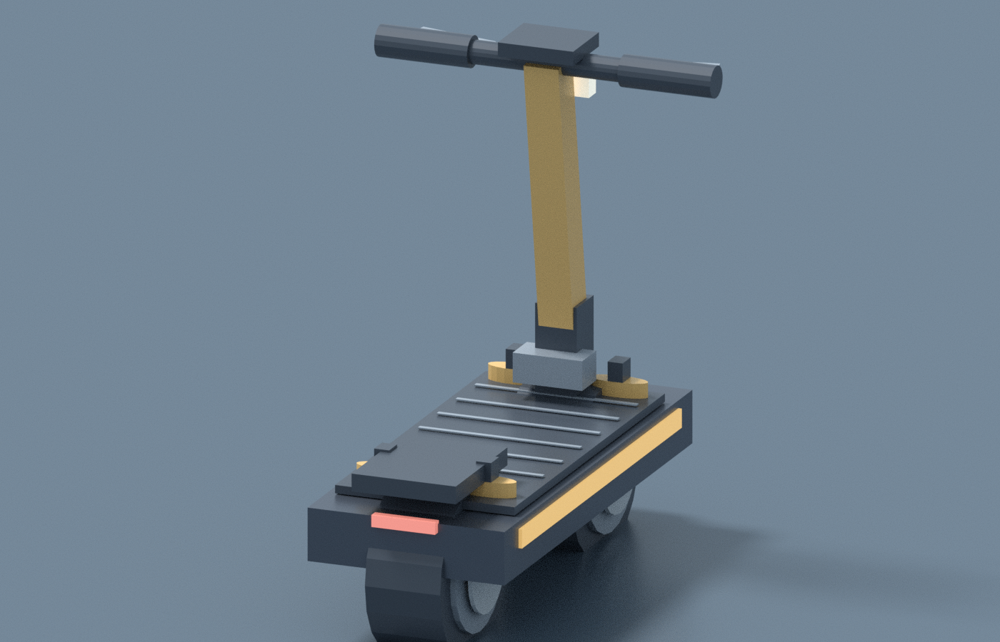

# Riverside / Iron Island — 0.6.0

Mapa ma 2800 studów szerokości, a grywalne punkty są w kompaktowym mieście i osobnej arenie. Spawn przy placu Riverside (-25,60). Jedź główną drogą na wschód; rzeka X430–610 ma rzeczywistą przerwę w lądzie, most X410–630 zapewnia przejazd. Arena zaczyna się dopiero na X800, objective leży na X1050. Nie ma COMBAT przy spawnie.

| Stanowisko | X / Z |
| --- | --- |
| Garage + pickup | -180 / -58; pickup 16 studów na lewo i 6 do przodu |
| Dealer / ekspozycja 5 modeli | -80 / -58 |
| Workshop | 30 / -58 |
| Arcade Supply | 145 / -58 |
| Street Studio | -180 / 145 |
| Fish Buyer | -340 / 285 |
| Fishing Dock | -340 / 355 |

Sklepy mają podłogę, ściany, dach, witryny z otwartym środkowym wejściem 20 studów, ladę, półki i własnego statycznego sprzedawcę. Garaż ma żółty pickup z E, salon pokazuje ofertę zamiast udawać pojazdy graczy. Warsztat ma podnośnik. Plac ma fontannę/rzeźbę, ławki i drzewa. Ulice mają chodniki, przejścia, lampy i znaki. Arena ma bramę, magazyny, kontenery, cover i rampy.

Hulajnogi: 45 części na model, pięć kolorów, własne zawieszenie/tarcze/manetki/deck/światła/dashboard. Wsiadanie sprawdza właściciela, dane, stan, dystans i ściany, następnie serwer przenosi postać do własnego siedzenia i powiadamia MovementGuard. Ponowne wsiadanie E lub Garage→WSIĄDŹ. R15 ma targety rąk i stóp i proceduralne IK; nie zakładamy posiadania animacji. R6 używa standardowego siedzenia.

## Podglądy wygenerowanej geometrii

**To rendery Blender z eksportu rzeczywistego kodu Luau przez mock API, nie zrzuty Roblox Studio.** Materiały, światło, avatar i fizyka w Roblox mogą wyglądać inaczej. Te obrazy nie są testem Play.

## Rozwój i weryfikacja

`python3 scripts/check-project.py` sprawdza 82 źródła i 18 zestawów testów, eksportuje geometrię, weryfikuje 1092 części / 168 collidable, most, brzegi, odległą arenę, sześć wejść i zgodność ScenePreview. Po zmianie geometrii: `python3 scripts/export-scene.py`, `python3 scripts/generate-preview.py`, pełne testy. Native preview jest rzeczywistym modelem Rojo, dostępnym przed Play; runtime usuwa go i generuje modułowy świat.

Opcjonalnie odtworzenie obrazów: Blender4.3.2, `blender -b -t 4 --python-exit-code 1 --python scripts/render-scene.py -- city docs/previews/city.png`; analogicznie bridge/scooter. Blender nie jest wymagany do grania ani CI. Przeprowadzone testy nie zastępują odbioru pojazdu/IK/raycast/collision/mobile/latency w Studio.
